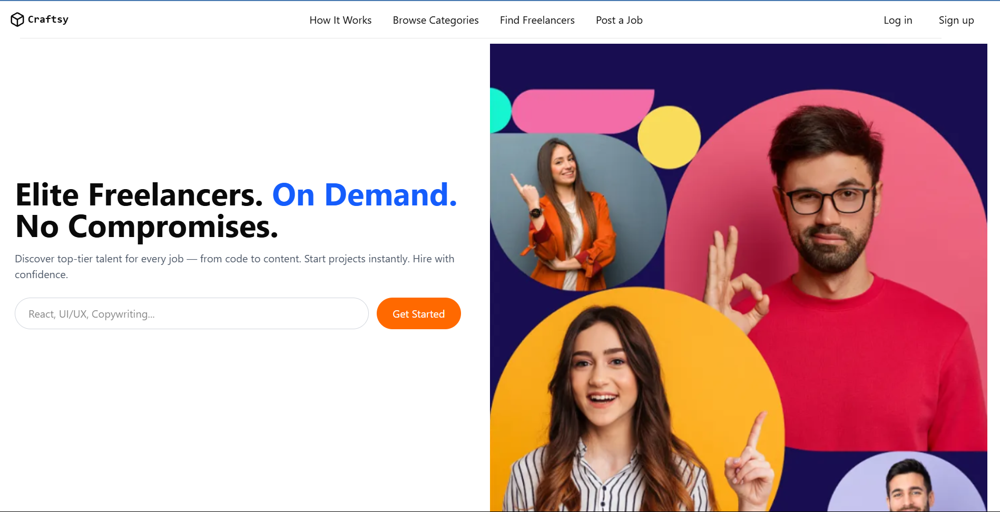
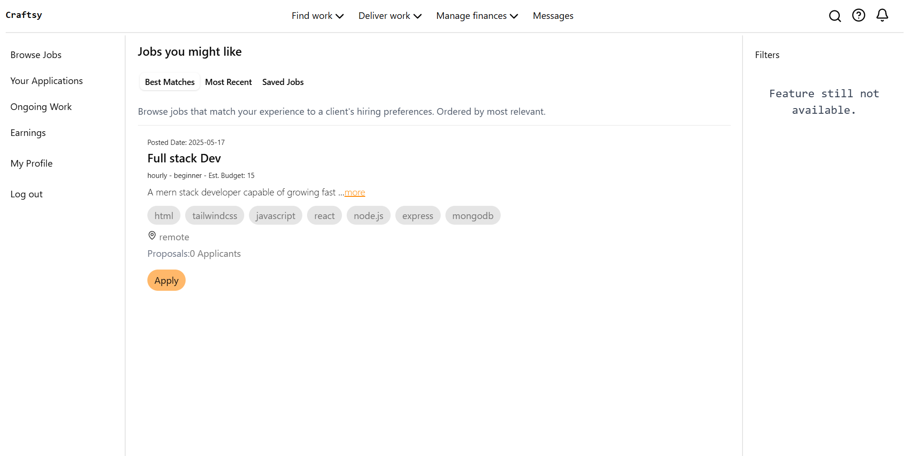
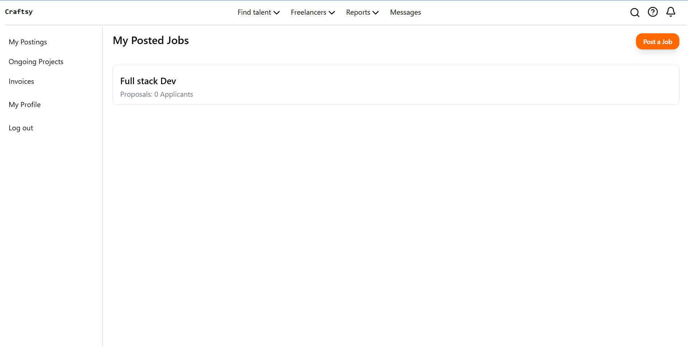

# Craftsy 🎨

Craftsy is a full-stack freelance marketplace designed to seamlessly connect clients with creative freelancers. It streamlines project collaboration with secure authentication, real-time updates, and a user-friendly interface to get creative work done efficiently.

## 🔍 Preview

Here’s a quick look at Craftsy in action:

### 🏠 Home Page

Landing page showing available freelance services and key platform features.

### 💼 Freelancer Job Listing

Freelancers can browse jobs, apply to listings, and manage their profile.

### 👤 Client Dashboard

Interface for clients to post new jobs, track applicants, and manage listings.

## 🛠 Tech Stack

- Frontend: React, Tailwind CSS
- Backend: Node.js, Express
- Database: MongoDB, Mongoose
- Authentication: JWT, bcrypt

## ✨ Features

- 🔐 Secure user authentication using JWT
- 🎯 Clients can post, edit, and manage job listings
- 🧑‍💻 Freelancers can browse and apply to jobs
- 📱 Fully responsive design with Tailwind CSS

## Live Demo

👉 [Live Demo](https://craftsy.vercel.app/)

## ⚙️ Getting Started

1. Clone the repo.
2. Run `npm install` in both the `/Backend` & `/Frontend` folders.
3. Create `.env` files in `/Backend` & `/Frontend` to configure your environment variables (database connection, JWT secret, server port, backend URL).
4. Run both servers with (`npm run dev`) and open `http://localhost:5173` in your browser.

## 📁 Folder Structure

Craftsy/
├── Backend/
│ └── src/
│ ├── controllers/
│ ├── middleware/
│ ├── models/
│ └── routes/
├── Frontend/
│ └── src/
│ ├── Component/
│ ├── pages/
│ └── App.jsx
├── screenshots/
└── README.md

## 🔮 Future Improvements

- 🧾 Payment integration with Stripe
- 💬 Real-time chat between clients and freelancers
- ⭐ Ratings and reviews for users

## 📄 License

This project is licensed under the MIT License.

## 📬 Contact

Created by Sarit Bose

- 📩 saritbose26@gmail.com
- 🔗 [LinkedIn](https://linkedin.com/in/sarit-bose)
