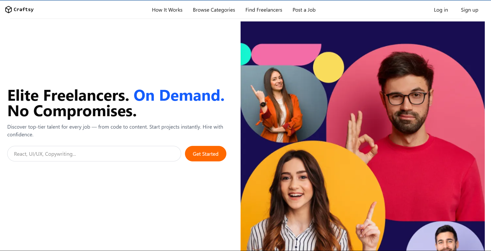
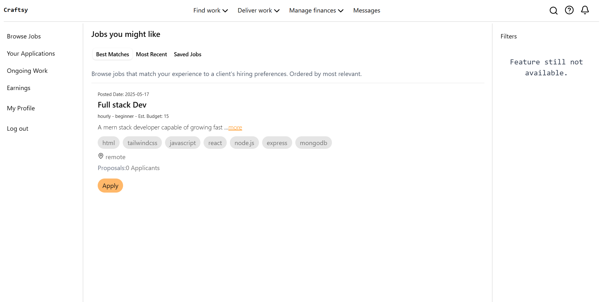
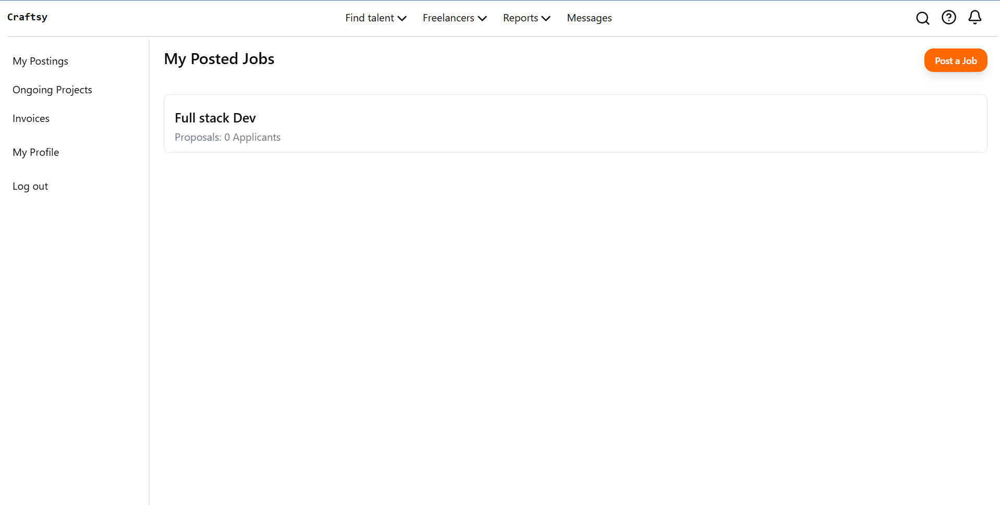

# Craftsy 🎨

Craftsy is a full-stack freelance marketplace designed to seamlessly connect clients with creative freelancers. It streamlines project collaboration with secure authentication, real-time updates, and a user-friendly interface to get creative work done efficiently.

## Preview

Here’s a quick look at Craftsy in action:

  

## Tech Stack

- React + Tailwind CSS (Frontend)
- Node.js + Express (Backend)
- MongoDB + Mongoose (Database)
- JWT & bcrypt (Authentication & Security)

## Features

- User registration & login with JWT authentication
- Client dashboard to post and manage jobs
- Freelancer dashboard to browse and apply for jobs
- Responsive, clean UI using Tailwind CSS

## Live Demo

[Live Demo](https://craftsy.vercel.app/)

## Getting Started

1. Clone the repo.
2. Run `npm install` in both the `/Backend` & `/Frontend` folders.
3. Create `.env` files in `/Backend` & `/Frontend` to configure your environment variables (database connection, JWT secret, server port, backend URL).
4. Run both servers with (`npm run dev`) and open `http://localhost:5173` in your browser.

## Contact

Created by Sarit Bose — [LinkedIn](https://linkedin.com/in/sarit-bose) | Email: saritbose26@gmail.com
